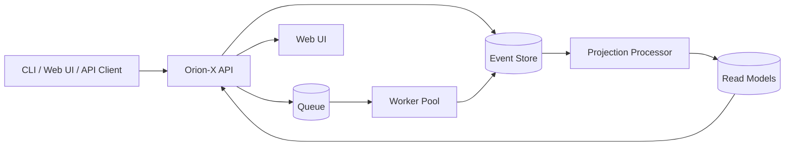

# Orion-X

[](https://github.com/<YOUR_GITHUB_USERNAME>/orion-x/actions/workflows/ci.yml)
[](./LICENSE)


Orion-X is an event-oriented workflow orchestration project focused on reliable execution, scalable workers, and observable DAG-based runs.

> Current repository state: this repo is now documentation- and contributor-ready. Runtime services (`api`, `worker`, `web`) are documented as target components and should be added/updated to match these docs as implementation evolves.

## Features

- Event-oriented workflow orchestration model.
- DAG-style workflow definitions with explicit task dependencies.
- Worker queue processing model (documented architecture).
- Projection/read-model pattern for fast run visibility.
- DevEx-focused open-source scaffolding (CI, templates, contribution docs).

## Architecture



See deeper notes in [docs/architecture.md](docs/architecture.md).

## Quick Start

### Prerequisites

- Node.js 20+
- `pnpm` 9+
- Docker + Docker Compose

### Clone and bootstrap

```bash
git clone https://github.com/<YOUR_GITHUB_USERNAME>/orion-x.git
cd orion-x
pnpm install
```

### Start dependencies (if `docker-compose.yml` is present)

```bash
docker compose up -d
```

### Start local development

```bash
make dev
```

> If application packages are not yet present in your local clone, follow [docs/development.md](docs/development.md) to scaffold or adapt scripts.

## Demo

Demo screenshot placeholder instructions: see [docs/dashboard.md](docs/dashboard.md).

Typical flow (once services are running):

1. Open the web UI at `http://localhost:3000`.
2. Create an organization.
3. Register a workflow spec.
4. Trigger a run and inspect run state transitions.

### Sample API calls

```bash
# 1) create org
curl -X POST http://localhost:4000/api/v1/orgs \
  -H 'Content-Type: application/json' \
  -d '{"name":"acme"}'

# 2) create task (example endpoint shape)
curl -X POST http://localhost:4000/api/v1/tasks \
  -H 'Content-Type: application/json' \
  -d '{"orgId":"org_123","name":"extract","type":"http"}'

# 3) schedule run
curl -X POST http://localhost:4000/api/v1/workflows/wf_daily_etl/runs \
  -H 'Content-Type: application/json' \
  -d '{"input":{"date":"2026-01-01"}}'

# 4) view runs
curl http://localhost:4000/api/v1/workflows/wf_daily_etl/runs
```

> Endpoint paths may need adjustment to match your implementation. Keep the docs and API contract aligned as code evolves.

## Example Workflow Spec

```yaml
id: wf_daily_etl
version: 1
tasks:
  - id: extract
    type: http
    config:
      url: https://example.internal/extract
  - id: transform
    type: container
    needs: [extract]
    config:
      image: ghcr.io/example/transform:latest
  - id: load
    type: sql
    needs: [transform]
    config:
      statement: "CALL load_daily_partition();"
```

More examples: [docs/workflows.md](docs/workflows.md).

## Commands Reference

```bash
make dev     # run local development stack
make up      # start docker compose dependencies
make down    # stop docker compose dependencies
make lint    # run lint checks
make test    # run tests
```

## Troubleshooting

- **`pnpm: command not found`**: install pnpm (`corepack enable && corepack prepare pnpm@latest --activate`).
- **Docker services fail to start**: run `docker compose logs` and verify required ports are free.
- **API/Web port mismatch**: confirm values in `.env` and service config.
- **CI fails with missing scripts**: ensure `package.json` scripts (`lint`, `test`) exist for each package.

## Roadmap

- Add production-ready API, worker, and web packages in a pnpm workspace.
- Publish a versioned workflow schema and migration strategy.
- Add robust e2e suite with seeded fixtures and isolated environments.
- Ship Helm chart / Terraform modules for cloud deployment.

## License

This project is licensed under the MIT License. See [LICENSE](LICENSE).
