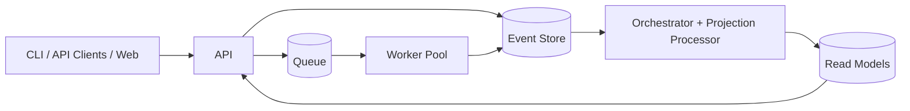

# Orion-X

[](https://github.com/<YOUR_GITHUB_USERNAME>/orion-x/actions/workflows/ci.yml)
[](./LICENSE)


Orion-X is a workflow orchestration foundation for teams that want reliable, auditable execution built around event streams and DAG semantics.

It exists to make workflow runs observable and reproducible by default: writes are event-first, execution is queue-backed, and query performance comes from projections.

## Features

- Event-oriented orchestration architecture with append-first state changes.
- DAG workflow model with explicit task dependencies.
- Queue + worker execution flow for scalable task processing.
- Projection/read-model pattern for low-latency run visibility.
- Contributor-ready repository standards (CI, templates, security, governance).

## Architecture



See the full architecture breakdown in [docs/architecture.md](docs/architecture.md).

## Quickstart

### Prerequisites

- Node.js 20+
- pnpm 9+
- Docker + Docker Compose

### Install

```bash
git clone https://github.com/<YOUR_GITHUB_USERNAME>/orion-x.git
cd orion-x
pnpm install
cp .env.example .env
```

### Start dependencies

```bash
make up
```

### Start local development

```bash
make dev
```

> Runtime services are intentionally lightweight in this repository stage. See [docs/getting-started.md](docs/getting-started.md) for run modes and setup details.

## Demo

### API walkthrough

```bash
# Create an org
curl -X POST http://localhost:4000/api/v1/orgs \
  -H 'Content-Type: application/json' \
  -d '{"name":"acme"}'

# Create a task
curl -X POST http://localhost:4000/api/v1/tasks \
  -H 'Content-Type: application/json' \
  -d '{"orgId":"org_123","name":"extract","type":"http"}'

# Schedule a workflow run
curl -X POST http://localhost:4000/api/v1/workflows/wf_demo/runs \
  -H 'Content-Type: application/json' \
  -d '{"input":{"date":"2026-01-01"}}'

# List runs
curl http://localhost:4000/api/v1/workflows/wf_demo/runs
```

### UI walkthrough

1. Open `http://localhost:3000`.
2. Create/select an organization.
3. Create a workflow from `examples/workflow.demo.json`.
4. Trigger a run and inspect task transitions.

Screenshot guidance (no binaries in-repo): [docs/screenshots.md](docs/screenshots.md).

## Commands

```bash
make dev           # run local development mode
make up            # start docker compose dependencies
make down          # stop docker compose dependencies
make lint          # run lint checks
make test          # run test checks
make system-check  # run baseline repo checks
pnpm changeset     # create a changeset
pnpm version-packages
pnpm release
```

## Troubleshooting

- `pnpm: command not found`: run `corepack enable` then install pnpm.
- Ports already in use: verify `.env` and stop conflicting local services.
- Docker startup issues: run `docker compose logs` and verify engine health.
- CI failures on scripts: ensure package scripts exist or rely on `--if-present` commands.

## Roadmap

- Add concrete API/worker/web packages with production-grade runtime behavior.
- Add end-to-end workflow tests with seeded fixtures.
- Add deployment artifacts (container publishing + infrastructure modules).

## Security and Contributing

- [Security policy](SECURITY.md)
- [Contributing guide](CONTRIBUTING.md)
- [Code of Conduct](CODE_OF_CONDUCT.md)
- [Documentation index](docs/index.md)

## License

MIT. See [LICENSE](LICENSE).
